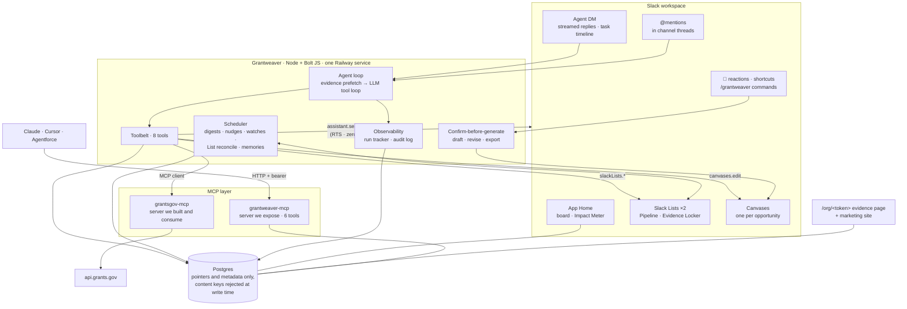
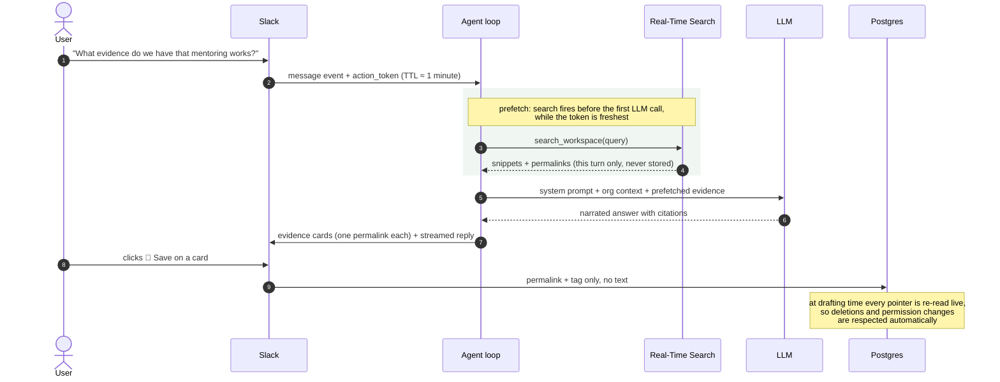

<p align="left">
  
</p>

# Grantweaver

**Turn your nonprofit's conversations into funding.**

Grantweaver is a Slack agent for the whole grant lifecycle. It finds live
federal funding on Grants.gov, digs cited impact evidence out of your own
workspace with Slack's Real-Time Search API, drafts grounded proposals into
Canvases, and keeps the pipeline in sync across the App Home, two Slack
Lists, and a shareable web page. It does all of this without storing a
single message.

Here's the problem it goes after. 69% of nonprofits lost funding this year,
and small orgs can't afford a grant writer. The proof funders ask for
(attendance numbers, parent testimonials, program wins) already exists in
Slack. Someone posted it, three people reacted, and it scrolled away within
a week. Grantweaver puts it back to work.

<!-- demo GIF goes here before submission -->
<!-- demo video: [3-minute walkthrough](YOUTUBE_URL) -->

## What that means for one organization

A small nonprofit with no grant writer spends close to 284 staff-hours a
year on grant work. Most of it is not writing. It's browsing funding
databases, scrolling channels to reconstruct evidence, and scrambling before
deadlines. Grantweaver returns about 236 of those hours. That's six
staff-weeks, every year:

<p align="left">
  
</p>

Hours convert to funding, because capacity is what caps small-org
applications, not ambition. Two more applications a year at the sector's
typical 20% success rate and a $25K average award changes the trajectory:

<p align="left">
  
</p>

Both charts are projections from a stated model, not measurements. The same
counters run live in the app. The App Home Impact Meter tracks opportunities
surfaced, dollars applied for, evidence items woven, and estimated hours
saved, and it states its heuristic right on the Home tab. Our impact claims
and the product's telemetry are the same numbers.

## The three challenge technologies, and where they live

| Technology | What it does here | Where |
|---|---|---|
| Slack AI capabilities | The agent surface: streamed replies with a live task timeline, loading statuses, state-aware suggested prompts, feedback buttons, thread titles | `src/assistant.js`, `src/agent/loop.js`, `src/agent/streamer.js` |
| Real-Time Search API | The evidence engine: live, permission-aware search over messages and files, with citations back to the source, plus the onboarding evidence scan | `src/agent/rts.js`, `src/services/scan.js`, `src/agent/tools.js` |
| MCP | Both directions: `grantsgov-mcp` is a Grants.gov server we built and consume; `grantweaver-mcp` exposes the pipeline to Claude, Cursor, Agentforce, or any MCP client | `src/mcp/` |

A note on timing. Scraping workspace history into an external database was
never safe, and it violates Marketplace policy. The Real-Time Search API
(February 2026) made permission-aware, zero-retention workspace search
possible for the first time. Grantweaver could not have been built five
months ago.

## What it actually does

**Discover.** Ask for funding in plain English. The agent searches
Grants.gov live through the MCP server, then runs a batched fit assessment
on the top matches: a 0 to 100 score and an eligibility verdict that quotes
the deciding phrase from the notice. Grants you mark "not relevant" stay
gone, and your reasons feed the next fit call as negative examples.
Forecasted opportunities get a Watch button instead of an Add button,
because you can't apply to a forecast.

**Prove.** Evidence lives in three layers. None of them store content.

- A live search tool over your watched channels, messages and files alike,
  rendered as cards with permalinks. Channels you excluded in settings never
  surface, full stop.
- An evidence locker of human-saved pointers. Save from a card button, a 🧵
  reaction on any message, or a message shortcut. Every pointer is a
  permalink plus a tag, mirrored into an Evidence Locker Slack List and the
  App Home. Delete a row in the List by hand and the locker forgets it too.
- An evidence index built by the onboarding scan, rebuildable any time by
  asking "rescan my workspace". A classifier groups what the scan found into
  themes a funder would recognize, each with a strength rating. Only theme
  labels, counts, and permalinks are stored. The snippets die with the scan.

**Draft.** Nothing slow runs without a visible yes. Asking for an LOI posts
a confirmation card first. Confirm with a button or a ✅ reaction, or open
the scope modal to pin specific evidence, emphasize sections, or add notes.
The draft is gathered fresh every time: workspace search runs first because
the search credential expires in under two minutes, then opportunity
details, then one completion into the opportunity's persistent Canvas. One
canvas per opportunity, five fixed sections (Overview, Requirements, Draft,
Evidence, Activity), regenerated in place, never duplicated. Every claim
carries a `[source](permalink)` link. Anything the workspace can't back up
is marked `[TEAM TO CONFIRM]` instead of invented.

**Revise as a team.** "Request changes" opens a revision thread. Teammates
pile on requests as plain replies, and no model runs while they argue. One
"Apply changes" click confirms scope, applies everything in a single
completion, posts a summary of what changed, and counts the
`[TEAM TO CONFIRM]` spots still open.

**Track.** The pipeline lives in four synced places: the database, the App
Home board, a Grant Pipeline Slack List, and each opportunity's Canvas
overview. The sync runs both ways. Change the stage, owner, or deadline by
hand in the List and Grantweaver adopts your edit, on the hourly sweep or on
demand. Adding a grant auto-extracts an application requirements checklist
from the notice itself (SAM.gov/UEI registration is always on it), and "mark
as submitted" politely refuses until the checklist is done.

**It doesn't wait to be asked.** Standing watches sweep Grants.gov three
times a day and post fresh matches. Deadlines get nudges at T-14, T-7, and
T-2, with snooze. A drafting opportunity that goes quiet for four days DMs
its owner. A suggested or reviewing one that sits for ten days gets a "worth
a decision?" card. Monday brings a digest of new matches. Friday brings a
`#memories` recap of what the agent actually did that week.

**Export.** A draft can leave Slack as a working `.md` pack (the
opportunity, the requirements, and evidence re-read live at export time,
ready to paste into any AI assistant) or as copy-ready application answers
keyed to the checklist.

**Show a funder.** `/grantweaver index` mints a 7-day HMAC magic link to a
public web page at `/org/<token>`: the evidence index by theme, pipeline
stats, and recent activity. It's built from counts and links only, for the
board member who isn't in the workspace. Paste the link in Slack and it
unfurls.

## Governance and observability

Agents that act need receipts.

- `/grantweaver logs` shows recent runs: surface, status, latency, tools
  called, token usage, and a sanitized error type.
- `/grantweaver state` shows the privacy-safe conversation state the agent
  carries between turns: goal, decisions, artifacts, and source pointers.
  Pointers, never text.
- `/grantweaver settings` lets an admin exclude channels from AI entirely
  (the agent refuses to search or answer over them) and switch proactive
  workflows off. Changes land in an audit log.
- Every run is tracked. Crossing a latency, token, or cost threshold writes
  an audit event and can alert an ops channel. A run can be cancelled while
  it's still going.
- The App Home shows pending confirmations, failed runs, and recent
  completions above the pipeline, so the first thing you see is what needs
  attention.

## How it fits together



And one turn, end to end. This is why drafts can cite without storing:



## Try it in 10 minutes

You need a Slack workspace you admin, a Postgres database, and one LLM API
key. Any OpenAI-compatible endpoint works; Gemini's free tier is enough.

1. **Create the Slack app.** Go to [api.slack.com/apps](https://api.slack.com/apps),
   choose *Create New App* → *From a manifest*, and paste `manifest.json`.
   Install it to your workspace, and enable the Agents & AI Apps toggle if
   Slack prompts for it.
2. **Configure.** `cp .env.example .env`, then fill in:
   - `SLACK_BOT_TOKEN`, `SLACK_SIGNING_SECRET`, `SLACK_APP_TOKEN` (a Socket
     Mode token with `connections:write`), and `SOCKET_MODE=true` for local
     dev
   - `LLM_BASE_URL`, `LLM_API_KEY`, `LLM_MODEL`
   - `DATABASE_URL`
   - `WEB_LINK_SECRET` (any long random hex) and `APP_BASE_URL`. These power
     the shareable evidence page; without them `/grantweaver index` and the
     Home tab's Evidence Index button can't mint links.
3. **Run.**
   ```bash
   npm install
   npm run migrate
   npm run dev
   ```
4. **Set up.** DM the Grantweaver agent and run `/grantweaver setup`. It's a
   60-second modal: mission, focus areas, which channels the agent may learn
   from and post to. Then reply **"scan my workspace"** when it asks. That
   typed message matters: Slack only issues the workspace-search credential
   on a real message, so the first evidence scan rides on it.
5. **Ask.** *"Find grants that fit our mission."* Add one to the pipeline,
   then ask for an LOI.

### Deploying (we use Railway)

One service runs everything: the Slack app, the MCP endpoint, the evidence
pages, and the marketing site, all on one port. `railway.json` ships in the
repo. Create a Railway project with a Postgres plugin, set the same env vars
with `SOCKET_MODE=false`, and point your Slack app's request URLs at
`https://<your-app>.up.railway.app/slack/events`. The health check lives at
`/healthz`. Any Node 20+ host works the same way.

Two things to change for your own install: the app ID baked into the Home
tab's "Ask Grantweaver" button (`APP_ID` in `src/surfaces/home.js`), and the
marketing-site links that point at `grantweaver.app`.

### Picking a model

The LLM client is provider-agnostic. `npm run llm:bakeoff` tests
tool-calling correctness and latency against a replica of a real agent turn,
so you pick a model with evidence instead of vibes. Reasoning models work
too: the loop detects completions that got truncated by hidden
chain-of-thought and retries with headroom.

### Connect your own MCP client

Grantweaver exposes its pipeline as an MCP server, so Claude, Cursor, or any
other MCP client can ask about your grants:

```bash
node --env-file=.env src/mcp/grantweaver-server.mjs   # serves :7802/mcp
claude mcp add --transport http grantweaver http://localhost:7802/mcp \
  --header "Authorization: Bearer $MCP_SHARED_SECRET"
```

Then ask: *"What's due in the next two weeks?"* Six read-only tools are
available: `list_pipeline`, `get_deadlines`, `search_grants`,
`list_watches`, `get_checklist`, and `get_impact_meter`. Requests without
the bearer secret get a 401. In production the same endpoint mounts on the
main service at `/mcp`, so there is no second process to run.

### The `/grantweaver` command

| Subcommand | What it does |
|---|---|
| `setup` | Org profile modal: mission, focus, channels, digest and memories channel |
| `settings` | AI-excluded channels and the proactive on/off switch (audit-logged) |
| `index` | Fresh 7-day magic link to the web evidence page |
| `digest` | Post this week's digest right now |
| `watch list` / `watch remove <id>` | Manage standing Grants.gov watches |
| `state` / `logs` | Agent conversation state · recent run telemetry |
| `simulate <sweep>` | Fire any proactive sweep on demand (allowlist-gated) |
| `clear` | Delete the agent's own messages from your DM |
| `reset` | Wipe the org, with a confirmation card, and start over |

## Privacy by architecture

Grantweaver never stores message content, and that's enforced in code, not
policy. The data layer rejects any write containing `text`, `snippet`,
`content`, or `message` keys, and conversation state is scrubbed the same
way. The evidence locker holds permalinks and tags. At drafting time the
agent re-reads each source live through Slack's Real-Time Search, so
deletions and permission changes are respected automatically. Even a
generated draft is held in process memory until a human confirms it,
because drafts quote your messages verbatim and a database row would break
the guarantee. Drafts always cite their sources, and nothing goes out
without human review.

## License

[MIT](LICENSE)
