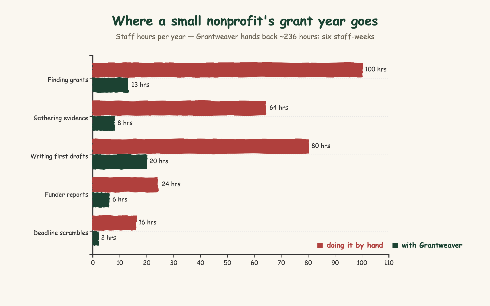
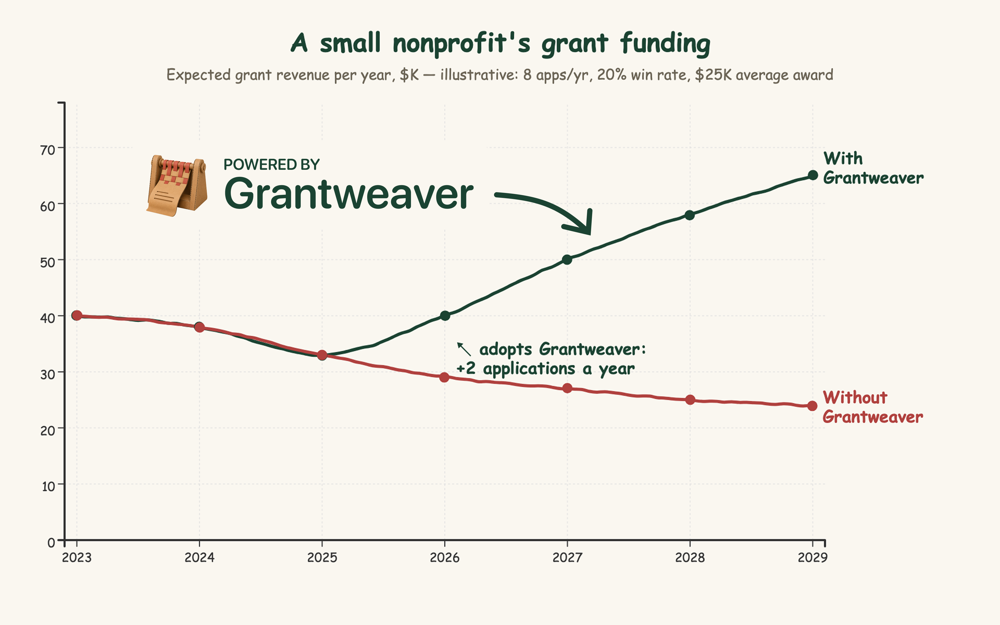
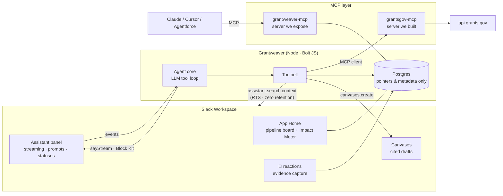

<p align="left">
  
</p>

# Grantweaver

**Turn your nonprofit's conversations into funding.**

Grantweaver is a Slack agent for the full grant lifecycle. It finds live
federal funding on Grants.gov, mines your own workspace for cited impact
evidence using Slack's Real-Time Search API, drafts grounded proposals into
Canvases, and tracks the whole pipeline from your App Home.

The problem it attacks: 69% of nonprofits lost funding this year, and small
orgs have no grant writer. The proof funders ask for (attendance numbers,
parent testimonials, program wins) is already sitting in Slack, posted by the
people who did the work and forgotten within a week. Grantweaver puts it back
to work.

<!-- demo GIF goes here before submission -->
<!-- demo video: [3-minute walkthrough](YOUTUBE_URL) -->

## What that means for one organization

A small nonprofit with no grant writer spends close to 284 staff-hours a year
on grant work. Most of it is not writing. It's browsing funding databases,
scrolling channels to reconstruct evidence, and scrambling before deadlines.
Grantweaver returns about 236 of those hours, six staff-weeks, every year:

<p align="left">
  
</p>

Hours convert to funding, because capacity is what caps small-org
applications, not ambition. Two more applications a year at the sector's
typical 20% success rate and a $25K average award changes the trajectory:

<p align="left">
  
</p>

Both charts are illustrative projections from a stated model, not
measurements. The same counters run live in the app: the App Home Impact
Meter tracks opportunities surfaced, dollars applied for, evidence items
woven, and estimated hours saved, and it discloses its heuristic in a
tooltip. Our impact claims and the product's telemetry are the same numbers.

## The three challenge technologies, and where they live

| Technology | What it does here | Where |
|---|---|---|
| Slack AI capabilities | The agent surface: streaming replies, statuses, suggested prompts, feedback buttons | `src/assistant.js`, `src/agent/loop.js` |
| Real-Time Search API | The evidence engine: live, permission-aware workspace search with citations back to source messages | `src/agent/rts.js`, `src/agent/tools.js` |
| MCP | Both directions: `grantsgov-mcp` (a Grants.gov server we built and consume) and `grantweaver-mcp` (exposes the grant pipeline to Claude, Cursor, Agentforce, or any MCP client) | `src/mcp/` |

A note on timing: scraping workspace history into an external database was
never safe, and it violates Marketplace policy. The Real-Time Search API
(February 2026) made permission-aware, zero-retention workspace search
possible for the first time. Grantweaver is a grant tool that could not have
been built five months ago.

## How it fits together



## Quickstart

1. Create a Slack app from `manifest.json` at [api.slack.com/apps](https://api.slack.com/apps) and install it to your workspace.
2. `cp .env.example .env` and fill in the Slack tokens, an LLM key, and a Postgres URL.
3. ```bash
   npm install
   npm run migrate
   npm run dev
   ```
4. Open the Grantweaver agent in Slack and ask it to find grants for your mission.

The LLM client is provider-agnostic (any OpenAI-compatible endpoint). Pick a
model with `npm run llm:bakeoff`, which tests tool-calling correctness and
latency against a replica of the real agent turn.

### Connect your own MCP client

Grantweaver exposes its pipeline as an MCP server (`grantweaver-mcp`), so
Claude, Cursor, or any other MCP client can ask about your grants:

```bash
node --env-file=.env src/mcp/grantweaver-server.mjs   # serves :7802/mcp

claude mcp add --transport http grantweaver http://localhost:7802/mcp \
  --header "Authorization: Bearer $MCP_SHARED_SECRET"
```

Then ask: *"What's due in the next two weeks for team T…?"* — four read-only
tools are available: `list_pipeline`, `get_deadlines`, `search_grants`, and
`get_impact_meter`. Requests without the bearer secret get a 401.

## Privacy by architecture

Grantweaver never stores message content. The evidence locker holds
permalinks and tags; at drafting time the agent re-reads each source live
through Slack's Real-Time Search, so deletions and permissions are respected
automatically. Drafts always cite their sources, and nothing goes out without
human review.

## License

[MIT](LICENSE)
